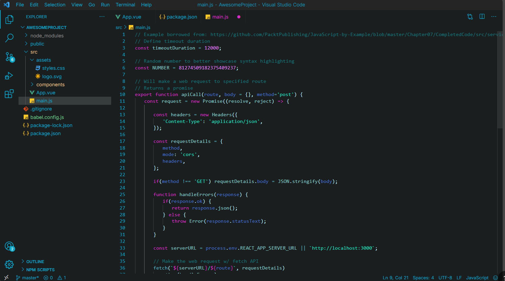
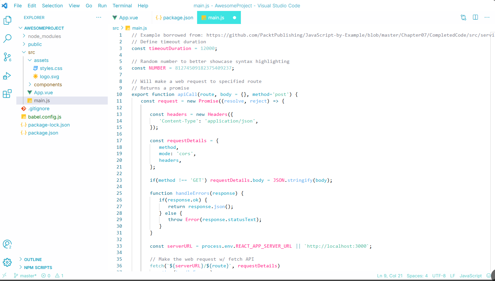

# Miku Theme

A custom VSCode theme by finnn that brings a clean and stylish dark color scheme to your coding environment.

## Preview

Here's a preview of the Miku Theme in action:

## Features

- Dark color scheme optimized for comfortable coding.
- Dark white scheme optimized for the psychopath.
- Custom syntax highlighting for popular languages.
- Ideal for long coding sessions with minimal eye strain.

## Installation

1. Open Visual Studio Code.
2. Go to the **Extensions** view by pressing `Ctrl+Shift+X`.
3. Search for "Miku Theme" by **finnn** and install it.
4. After installation, go to **Preferences > Color Theme** and select "Miku Theme."

## Usage

Once the theme is installed:

1. Go to **Preferences > Color Theme**.
2. Choose **Miku Theme** from the list to apply it to your editor.

## Changelog

### v1.1.0

- Initial release with a dark color scheme.

### v1.2.0

- Added support for multiple themes: **Miku Dark** and **Miku Light**.

## Contributing

Feel free to open issues or pull requests if you'd like to improve this theme or report any bugs. Contributions are always welcome!

## License

This theme is licensed under the [MIT License](LICENSE).
